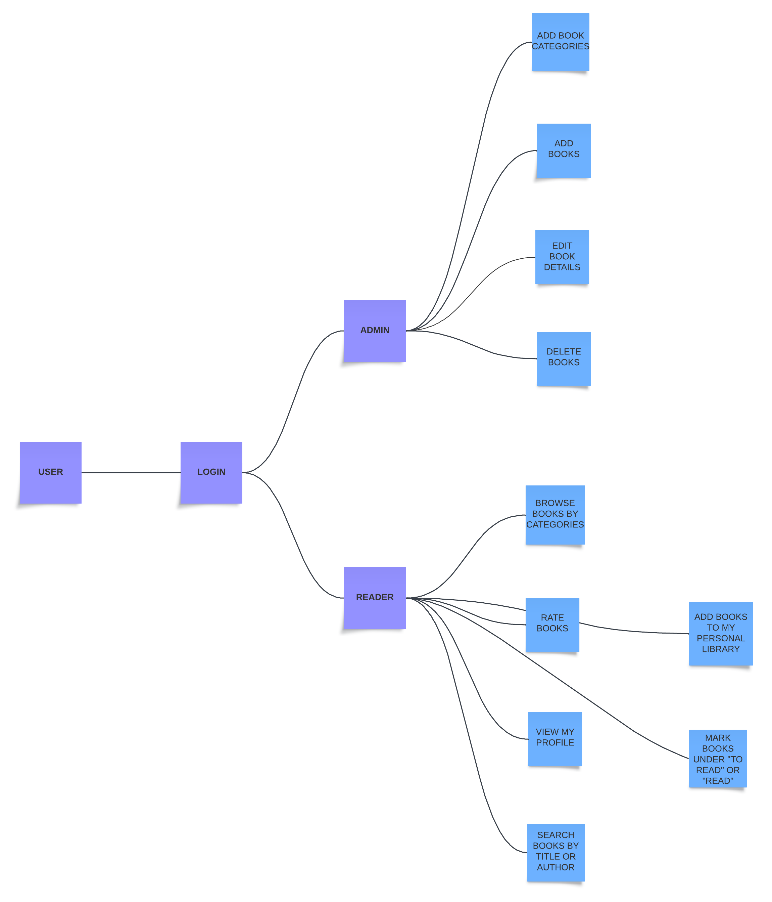

# Product vision
Noi vom realiza o aplicație web inspirată de Goodreads, folosind React, Node.Js și SQLite. Aplicația noastră este o platformă modernă și interactivă destinată pasionaților de lectură, care le permite să-și gestioneze și personalizeze experiența de citit. Utilizatorii pot crea conturi pentru a-și salva preferințele de lectură, pentru a organiza și urmări progresul lecturilor, precum și pentru a evalua și comenta cărțile citite, contribuind la o comunitate activă de cititori.    
Pentru administratori, aplicația oferă un sistem eficient de gestionare a catalogului de cărți, permițând adăugarea, editarea și ștergerea titlurilor și categoriilor, astfel încât biblioteca virtuală să fie mereu actualizată și relevantă. Cu funcții de căutare avansată, organizare pe categorii și acces la profiluri publice ale utilizatorilor, aplicația încurajează descoperirea de noi lecturi și facilitează schimbul de opinii și recomandări între utilizatori.    
Obiectivul final este de a crea o experiență digitală captivantă și interactivă care să susțină și să amplifice pasiunea pentru lectură și să ofere un spațiu personalizat pentru fiecare utilizator, fie că este un cititor ocazional sau un avid consumator de cărți.

# Requirements
## Functional Requirements
1. Gestionare utilizatori
    * Utilizatorii trebuie să poată crea un cont folosind email și parolă și să se autentifice securizat.
    * Utilizatorii trebuie să poată vizualiza profilul propriu, inclusiv lista de cărți din “Read” și “To Read”.
    * Utilizatorii trebuie să poată edita profilul și să își actualizeze preferințele de lectură.
2. Gestionare cărți
    * Administratorii trebuie să poată adăuga, edita și șterge cărți, incluzând detalii de bază (titlu, autor, descriere).
    * Utilizatorii trebuie să poată vizualiza o listă de cărți din catalogul comun.
    * Utilizatorii trebuie să poată accesa detalii despre o carte individuală (titlu, autor, descriere, rating mediu).
3. Interacțiuni utilizatori
    * Utilizatorii trebuie să poată adăuga cărți la listele personale “Read” și “To Read”.
    * Utilizatorii trebuie să poată evalua o carte pe o scară de 1-5 stele.
4. Căutare și navigare
    * Utilizatorii trebuie să poată căuta o carte după titlu sau autor.
    * Utilizatorii trebuie să poată filtra cărțile după categorii (e.g., Ficțiune, Istorie).
5. Gestionare categorii
    * Administratorii trebuie să poată crea, edita și șterge categorii pentru organizarea cărților.
## Non-Functional Requirements
1. Securitate de bază
    * Sistemul trebuie să aibă autentificare pentru utilizatori și să asigure păstrarea parolelor într-o formă securizată (de exemplu, folosind hashing simplu).
2. Performanță de bază
    * Aplicația trebuie să răspundă rapid pentru majoritatea acțiunilor uzuale, în special căutarea și afișarea listelor de cărți.
3. Compatibilitate de bază
    * Aplicația trebuie să funcționeze corect în browserul Chrome / Microsoft Edge, fără a fi necesară optimizarea pentru alte browsere sau dispozitive mobile.

# Features:
* Gestionarea conturilor utilizatorilor și autentificare securizată.
* Gestionarea cărților din bibliotecă (adăugare, vizualizare, editare și ștergere).
* Funcționalități de rating și recenzii pentru cărți.
* Funcționalități de catalogare și organizare a cărților în categorii.
* Gestionarea bibliotecii personale a utilizatorului, cu liste “Read” și “To Read”.
* Căutare și filtrare de cărți după titlu, autor sau taguri.
* Vizualizarea profilului personal și a profilului altor utilizatori.

# User stories
1. Ca Utilizator, vreau să îmi creez un cont pentru a-mi salva preferințele de cărți și pentru a-mi gestiona biblioteca personală.
2. Ca Utilizator, vreau să mă autentific în siguranță pentru a putea accesa profilul meu și a interacționa cu platforma.
3. Ca Administrator, vreau să adaug cărți noi cu detalii precum titlu, autor, rating, descriere și taguri, astfel încât utilizatorii să aibă cele mai noi opțiuni de explorat.
4. Ca Administrator, vreau să editez detaliile unei cărți existente pentru a corecta eventualele erori sau a face actualizări.
5. Ca Administrator, vreau să șterg cărți din catalog pentru a elimina intrările învechite sau incorecte de pe platformă.
6. Ca Utilizator, vreau să vizualizez informații detaliate despre o carte, inclusiv titlul, autorul, ratingul, descrierea și tagurile, pentru a decide dacă vreau să o citesc.
7. Ca Utilizator, vreau să evaluez cărțile citite pe o scală (1-5 stele) pentru a contribui la evaluările comunității și pentru a descoperi alte cărți care mi-ar plăcea.
8. Ca Utilizator, vreau să las comentarii la cărți pentru a-mi împărtăși gândurile și a participa la discuții cu alți cititori.
9. Ca Utilizator, vreau să citesc comentariile lăsate de alții la o carte pentru a obține perspective diferite.
10. Ca Utilizator, vreau să adaug cărți în biblioteca mea personală în listele „Citite” și „De citit” pentru a ține evidența celor citite și a celor pe care vreau să le citesc.
11. Ca Utilizator, vreau să vizualizez profilul meu personal unde pot vedea cărțile adăugate, evaluările și comentariile mele, pentru a-mi urmări parcursul lecturilor.
12. Ca Utilizator, vreau să vizualizez profilurile publice ale altor utilizatori, inclusiv listele lor de lectură și evaluările, pentru a descoperi cărți bazate pe recomandările lor.
13. Ca Utilizator, vreau să caut cărți după titlu, autor sau taguri pentru a găsi rapid ceea ce caut.
14. Ca Administrator, vreau să creez, să actualizez și să șterg categorii de cărți (ex: ficțiune, știință, mister) astfel încât utilizatorii să poată găsi ușor cărțile după gen.
15. Ca Utilizator, vreau să navighez cărțile după categorii (ex: ficțiune, mister) pentru a găsi genuri care îmi plac.

# Class Diagram

# Use Case Diagram

